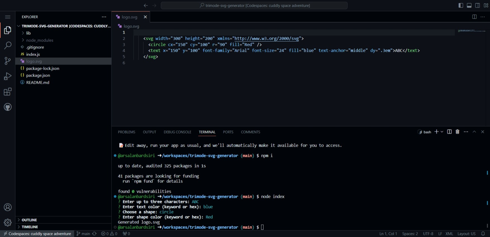

# TriMode SVG Generator

Welcome to the TriMode SVG Generator tool! This application empowers you to effortlessly create, customize, and export SVG logos tailored for your needs.

## Table of Contents

- [Description](#description)
- [Features](#features)
  - [User-Friendly Interface](#user-friendly-interface)
  - [Customization Tools](#customization-tools)
  - [Export Options](#export-options)
  - [Templates Library](#templates-library)
- [Installation](#installation)
- [Usage](#usage)
- [Technologies Used](#technologies-used)
- [Demo](#demo)
- [Contributors](#contributors)
- [Contact](#contact)
- [License](#license)

## Description

The TriMode SVG Generator is designed to simplify the process of creating SVG logos. Whether you're a designer seeking a tool to streamline your workflow or someone without design experience wanting a professional-looking logo, this tool is crafted for you. With a rich set of features, it promises both versatility and user-friendliness.

## Features

### User-Friendly Interface

**Simplicity is at the core of TriMode.** The intuitive interface ensures even first-time users can navigate and operate the tool with ease. From choosing designs to exporting the final SVG, every step is guided and clear.

### Customization Tools

**Make the logo truly yours.** With a range of customization tools, adjust colors, shapes, and dimensions to your liking. Add text, select fonts, and experiment until you find the perfect design.

### Export Options

**Flexibility in your hands.** Not only can you export your designs as SVG files, but the generator also provides options for PNG, JPEG, and other popular formats. Choose the resolution and quality that suits your needs.

### Templates Library

**A head start to your design.** To speed up the creation process, TriMode comes equipped with a library of templates. Choose a base design and modify it, or draw inspiration for your unique creation.

## Installation

To get started with the TriMode SVG Generator:

1. Clone this repository: `git clone https://github.com/username/trimode-svg-generator.git`
2. Navigate to the project directory: `cd trimode-svg-generator`
3. Install necessary dependencies if any. `npm i`
4. Launch the application. `node index.js`

## Usage

- Open the TriMode SVG Generator application.
- Start by selecting a template or beginning from scratch.
- Utilize the customization tools to design your logo.
- Preview the design in real-time.
- Once satisfied, choose your desired export format and download.

## Technologies Used

The TriMode SVG Generator is powered and tested by:

- 
- 
- 

## Demo

Experience the TriMode SVG Generator in action:

## Contributors

This innovative tool was carefully developed by [Arsalan Bardsiri](https://github.com/arsalanbardsiri).

## Contact

For any questions, suggestions, or potential collaborations:

- Email: <arsalanbardsiri@gmail.com>
- GitHub: [github.com/arsalanbardsiri](https://github.com/arsalanbardsiri)

## License

TriMode SVG Generator is open-source and licensed under the [MIT License](LICENSE).

Thank you for exploring the TriMode SVG Generator. Happy designing!
